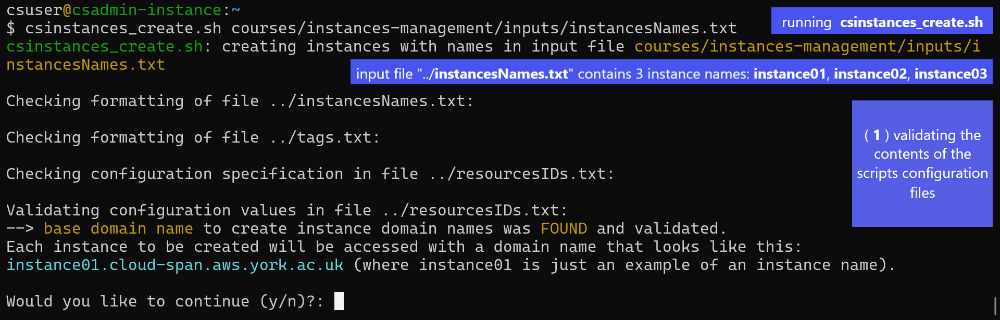
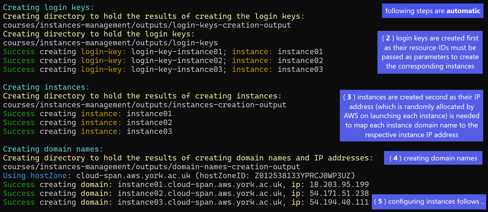
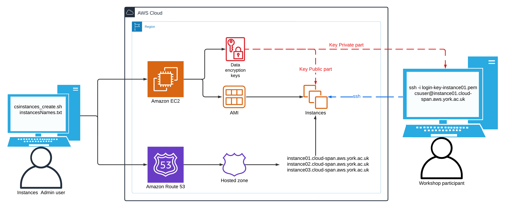

[](https://doi.org/10.5281/zenodo.6779269) [](https://www.repostatus.org/#active) 

# Automated Management of AWS Instances for Training with Bash Scripts

## Overview
Amazon Web Services (AWS) instances provide a convenient way to run training on complex data analysis workflows without requiring participants to install software packages or store large data volumes locally on their computers. However, efficiently managing dozens of instances is challenging for training providers. Specifically, managing multiple instances through a Graphical User Interface (GUI), such as the AWS Console, is rather cumbersome and error-prone.

The Bash Scripts in this repository make it quick and easy to manage Linux AWS instances that are ***pre-configured*** with all the software analysis tools and data needed for a course, and ***accessible*** using encrypted login keys and **optional** domain names. Creating over 30 instances takes 10-15 minutes.

We developed the Scripts to manage instances configured for training in genomics and metagenomics. However, the Scripts are broadly applicable to manage instances configured for any training purpose. 

A comprehensive [online tutorial](https://cloud-span.github.io/cloud-admin-guide-v2q/) describes how to set up and use an AWS account and the Scripts, and how to customise AWS instance templates with other software tools and data. We anticipate that others offering similar training may benefit from using the scripts regardless of the analyses being taught.

This README file provides an overview of these topics:

1. **[The Scripts organisation](#1-the-scripts-organisation)**

2. **[Preparing the Scripts environment](#2-preparing-a-scripts-running-environment)**

3. **[Running the Scripts](#3-running-the-scripts)**

4. **[Using Instances and Customising AMIs](#4-using-instances-and-customising-amis)**

5. **[Customising the Login Account of Workshop Participants](#5-customising-the-login-account-of-workshop-participants)**

6. **[The Scripts design and implementation](#6-the-scripts-design-and-implementation)**

7. **[Validating the target Workshop Environment](#7-validating-the-target-workshop-environment)**

8. **[Overview of the Online Tutorial](#8-overview-of-the-online-tutorial)**

9. **[Conclusions](#9-conclusions)**

10. **[Acknowledgements](#acknowledgements)**


## 1. The Scripts organisation

The scripts are listed below. The scripts "`csinstances_*.sh`" are to be run  by the person in charge of managing instances for workshops. The scripts "`aws_*.sh`" are invoked by the scripts `csinstances_create.sh` or `csinstances_delete.sh` to either create or delete instances and related resources: login keys, IP addresses, and domain names (if managed). The  script `colours_utils_functions.sh` provides text colouring functions and utility functions that validate the invocation and results of the other scripts.

The scripts "`aws_*.sh`" can each be run directly in the same way the scritps "`csinstances_*.sh`" are run (as described shortly), but this is not recommended **except** for the purpose of improving a script or troubleshooting a failed step in creating instances and related resources. The section [Troubleshooting](https://cloud-span.github.io/cloud-admin-guide-v2q/docs/lesson02-managing-aws-instances/02-instances-management.html#troubleshooting) of the tutorial describes the conditions under which we have had to run some secondary scripts directly.

```
aws_domainNames_create.sh    aws_instances_terminate.sh    csinstances_create.sh
aws_domainNames_delete.sh    aws_loginKeyPair_create.sh    csinstances_delete.sh
aws_instances_configure.sh   aws_loginKeyPair_delete.sh    csinstances_start.sh
aws_instances_launch.sh      colour_utils_functions.sh     csinstances_stop.sh
```
## 2. Preparing a Scripts running environment

Before running the scripts, an AWS account and a terminal environment must be configured (as described in the tutorial [ 17 ]). Then, prior
to creating instances for a workshop, three files must be created and organised as follows:

- **_instancesNamesFile.txt_** — contains the names of the instances to be created and managed. **Only the name of this file can be changed** if
    preferred. This file must contain only one instance name per line, and each instance name must start with an alphabetic character
    followed by alpha-numeric characters, hyphens (-) or underscores (_) only.
- **resourcesIDs.txt** — contains a set of space-separated "key value" pairs that specify the AWS resources to use in creating each instance and related resources, see the file example below. The example below shows the contents of the **resourcesIDs.txt** file we use for the Cloud-SPAN Genomics course [18]:

- **tags.txt** — contains a set of space-separated "key value" pairs to tag instances and related resources upon creation. **This file is optional**. If specified, it must contain **only one** "key value" pair per line. Up to 10 "key value" pairs are processed. Examples:

```
group      BIOL
project    cloud-span
status     prod
pushed_by  manual
```

### Example of a **resourcesIDs.txt** file

```
KEYWORD           VALUE examples  (Cloud-SPAN’s for Genomics course using instance domain names)
                                             ## NB: "key value" pairs can be specified in any order
imageId           ami-07172f26233528178      ## NOT optional: instance template (AMI) id
instanceType      t3.small                   ## NOT optional: processor count, memory size, bandwidth
securityGroupId   sg-0771b67fde13b3899       ## NOT optional: should allow ssh (port 22) communication
subnetId          subnet-00ff8cd3b7407dc83   ## optional: search vpc in AWS console then click subnets
hostZone          cloud-span.aws.york.ac.uk  ## optional: specify to use instance domain names
hostZoneId        Z012538133YPRCJ0WP3UZ      ## optional: specify to use instance domain names
```

As shown in this example, a resourcesIDs.txt file can have comments in addition to the "key value" pairs to specify. The "key value" pairs can be specified in any order, but each key word must be the first item in a line and its corresponding value the second item in the same line. The key words in the example must be used but they are NON-case sensitive. The three Not optional "key value" pairs must be specified.

The values all are validated. The value ofimageIdis validated to correspond to an AMI in your AWS account or to a public AMI available in the AWS region on which your are running the scripts. The value ofinstanceTypeis validated to be a valid AWS instance type. The values of securityGroupId, subnetId,hostZone and hostZoneId are validated to exist in your AWS account. The key word subnetId and its value are optional. If not specified, the scripts will try to obtain a subnetID from your AWS account. We have successfully tested the scripts to obtain and use a subnetID running the scripts with a personal AWS account and with an institutional AWS account (see details in section Validating the Workshop Environment below). The key words `hostZone` and `hostZoneId` and their values are optional. If specified and valid, each instance will be accessed using a
domain name which will look like this: instance01.cloud-span.aws.york.ac.uk , where instance01 is just an example of a specified instance name and cloud-span.aws.york.ac.uk is the base domain name (hostZone) in the example. If `hostZone` and `hostZoneId` and their values are not specified, each instance will be accessed using the public IP address or the generic domain name allocated by AWS which will look like this: `34.245.22.106` or `ec2-34-245-22-106.eu-west-1.compute.amazonaws.com`.


The three files must be placed inside a directory called **inputs** , and the **inputs** directory must be placed within at least one other directory, whose name you can choose, and to which we refer to as **Workshop Environment** ( **WE** ). We use this directory structure to manage instances
for our workshops:

```
courses                          ### you can omit this directory or use other name
    genomics01                   ### workshop/course WE name; you can use other name
        inputs                   ### you CANNOT use other name
            instancesNames.txt   ### you can use other name
            resourcesIDs.txt     ### you CANNOT use other name
            tags.txt             ### OPTIONAL - you CANNOT use other name
        outputs                  ### created automatically by the scripts - don’t modify
    genomics02                   ### another WE: inputs and outputs directories inside
    metagenomics01               ### another WE: inputs and outputs directories inside
...
```

The `outputs` directory inside a WE is automatically created by the Scripts to store the results of invoking AWS services as described below.


## 3. Running the Scripts

Running the scripts requires only the path of the file that contains the names of the instances to create, stop, start or delete. Login keys, IPcaddresses and domain names used by the instances are created or deleted automatically. Figure 1 shows a Linux terminal where the scriptcsinstance_create.shhas been run thus (second line in the figure):

```
$ csinstances_create.sh courses/instances-management/inputs/instancesNames.txt
```

Creating instances involves 5 or 4 steps depending on whether domain names to access instances are to be managed or not:

( **1** ) validating the contents of the scripts configuration files ( **_instancesNames.txt_** passed as parameter, **tags.txt** if found, and **resourcesIDs.txt** ) as described above and shown in Figure 1. **If no problem is found** in these files, the **option to continue** with the **configuration detected** , regarding managing or not managing domain names to access instances, **is displayed** for the user to confirm or cancel the run. **If there is a problem with the files** , messages (not shown) are displayed that point out the specific problem/s in each file and the run is aborted.

In Figure 1, the configuration detected corresponds to managing domain names to access instances, that is,`hostZone` and `hostZoneId` and valid values were specified and found in the **resourcesIDs.txt** file and were validated.
    
If `hostZone` and `hostZoneId` are **not** specified, the **option to continue** looks like this:

```
--> NO base domain name was FOUND.
Each instance to be created will be accessed with the IP address or the generic domain name provided
by AWS, which look like this: 34.245.22.106 or ec2-34-245-22-106.eu-west-1.compute.amazonaws.com.

Would you like to continue (y/n)?:
```
( **2** ) creating login keys.

( **3** ) creating instances, each configured to use one of the login keys created in the previous step.

( **4** ) creating instances domain names as mapped to the respective instance IP addresses (AWS randomly allocates IP addresses to instances when instances are launched for the first time or started after having been stopped) — **THIS STEP is only run if** `hostZone` and `hostZoneId` and valid values were specified in the **resourcesIDs.txt** file.

( **5** ) configuring each instance both **to enable** the **_csuser_** account (used by workshop participants) to be logged in and **to change** the instance host name to the **instance name** (the default host name is the instance IP address) **regardless of whether domain names are to be managed or not**. This step is not shown in the figure.




**Figure 1.** Running the script `csinstances_create.sh` (second line) to create 3 instances with the names specified in the filecourses/.../instancesNames.txt: **instance01**, **instance02** , and **instance03** (one name per line). Creating instances involves 5 or 4 steps depending on whether domain names to access instances are to be managed or not. The run in the figure corresponds to domain names being managed but only the first 4 steps are shown. The last step (5) involves configuring each instance both **to enable** the **_csuser_** account (used by workshop participants) to be logged in and **to change** the instance host name to the instance name (the default host name is the instance IP address). **If domain names are not to be managed** , the step **creating domain names** (4 in the figure) is not run.


To stop or start the instances created with the command above, or to delete them along with all the related resources, you would run the scripts `csinstances_stop.sh`, `csinstances_start.sh` or `csinstances_delete.sh` using the same input file:

```
$ csinstance_stop.sh courses/instances-management/inputs/instancesNames.txt
$ csinstance_start.sh courses/instances-management/inputs/instancesNames.txt
$ csinstance_delete.sh courses/instances-management/inputs/instancesNames.txt
```

## 4. Using Instances and Customising AMIs

Each instance has two user accounts: **_csuser_** and **_ubuntu_**. You login to these accounts using the **ssh** program as in the examples below, which
correspond to how you would login to those accounts on the instances created in the example in Figure 1, wherein the instance names
specified were **instance01** , **instance02** , and **instance**.

```
ssh -i login-key-instance01.pem csuser@instance01.cloud-span.aws.york.ac.uk
ssh -i login-key-instance01.pem ubuntu@instance01.cloud-span.aws.york.ac.uk
...
ssh -i login-key-instance03.pem csuser@instance03.cloud-span.aws.york.ac.uk
ssh -i login-key-instance03.pem ubuntu@instance03.cloud-span.aws.york.ac.uk
```
Note that instance names are used by the scripts to "label" the names of the corresponding login key files, instances domain names, and other files. Each instance domain name is the previously configured _base domain name_ (in our casecloud-span.aws.york.ac.uk) prefixed with the corresponding instance name.

Workshop participants use the **_csuser_** account — all ’omics data and most software analysis tools are installed in this account.

The **_ubuntu_** account has **superuser privileges**. We use it to update system software, software analysis tools that need to be installed at system level, etc. We use the **_csuser_** account to update ’omics data and software analysis tools that can be installed at user account level. We update an instance as just outlined in order **to create a new AMI** (virtual machine template) from which to create new updated instances.

### Login to Instances When Domain Names Are NOT Managed

Assuming that **domain names** were **not managed** in the example in Figure 1 (but the instance names specified were those in the example: **instance01** , etc.), you would login to the **_csuser_** and **_ubuntu_** accounts thus:

```
ssh -i login-key-instance01.pem csuser@34.245.22.106      #### where 34.245.22.106 is just an example IP address
ssh -i login-key-instance01.pem ubuntu@34.245.22.106      #### the IP address of each instance will vary
...
```

## 5. Customising the Login Account of Workshop Participants

The **_csuser_** account is only available on instances created from a Cloud-SPAN AMI — "cs" in **_csuser_** stands for Cloud-SPAN project [ 19 , 20 ]; the Data Carpentry AMI uses the **_dcuser_** account for workshop participants.

The **_ubuntu_** account is available on instances created from any AWS Linux Ubuntu AMI, and is the **only account** that is **enabled to be logged in** when an instance runs for the first time. This enabling is performed by the **AWS service** that launches instances. When an instance boots for the first time, that service **adds** the **public key** part of the login key created to access the instance to **the file** `/home/ubuntu/.ssh/authorized_keys` --- thereafter the **private key** part of the login key can be used with **ssh** as shown above [ 21 ] to access the **_ubuntu_** account. The last step in creating instances, that is, **configuring instances** , enables the **_csuser_** account in each instance to be logged in by copying that file to the **_csuser_** account in/home/csuser/.ssh/authorized_keys. The copy is made through running a Bash script in the **_ubuntu_** account that is remotely invoked by the script `aws_instances_configure.sh`.

If instead of the **_csuser_** account you would like to use an account with a name related to your project, institution, etc., you can follow the steps below to create a new AMI from which you will create instances with your new user account (see details in the section [Configure an Instance to Become AMI]() in the tutorial):

- create an instance using the Cloud-SPAN (CS) Genomics AMI and login as the **_ubuntu_** user.
- create and initialise your new user account (as described in the tutorial)
- edit the script/home/ubuntu/bin/usersAuthorizedKeys-activate.shto replace the string **_csuser_** with the name of your new account — this script copies the file/home/ubuntu/.ssh/authorized_keysto the **_csuser_** account.
- delete or edit the file/etc/motd(message of the day) — it contains a screen welcome message that includes the Cloud-SPAN name.
- create a new AMI from the updated instance.

The CS Genomics AMI is of size 30-Gigabyte (GB). It has the scripts installed along with a few other scripts that will help you customise
your AMI. Two scripts automatically update system software and the Genomics software applications installed. The tutorial describes
how to modify these scripts to install other applications and to remove the ones installed, and how to use another script to automatically
increase the size of secondary storage and the file system up to 2 Terabytes.
Figure 2 shows an schematic of the scripts environment. We have described the left and right elements in that figure: the use of the
scripts and the use of instances created with the scripts. How the scripts manage the relevant AWS services is described below.




**Figure 2.** The scripts environment: the admin user of the scripts (on the left), the AWS service infrastructure used when domain names to access instances are managed, and a workshop participant accessing **instance01** using **_ssh_** with the respective private login key part. The Route 53 AWS service is not used when domain names are not managed.


## 6. The Scripts design and implementation

AWS services can be managed using (1) the AWS Console, (2) the AWS CLI (command line interface) program, (3) Software Development Kits (SDKs) or libraries with a programming language such as Python, Java, etc., or (4) infrastructure as code (IaC) blueprints. The level of automation increases from the AWS Console to IaC blueprints.

The scripts use the AWS CLI to manage instances and related resources. The scripts organisation is straightforward, with most communication between the scripts taking place through shared files. Some
scripts perform a fair amount of pattern matching in preparing AWS service requests, processing results requests and other tasks.

### The Scripts Execution Flow — Overview

We saw above how to run the scriptscsinstances_create.shandcsinstances_delete.sh: passing the path of the file that contains the names of the instances to be created or deleted (along with related resources). Those two scripts do not invoke the AWS CLI directly; they only invoke the scripts "aws_*.sh", passing each such script the file path received, as shown in the main code of `csinstances_create.sh` below. In the code, the file path is in the script variable$1, ascsinstances_create.shreceives the file path as the first (only) parameter:

```
check_theScripts_csconfiguration "$1"  || { message "$error_msg"; exit 1; }
aws_loginKeyPair_create.sh "$1"        || { message "$error_msg"; exit 1; }
aws_instances_launch.sh "$1"           || { message "$error_msg"; exit 1; }

if [ -f "${1%/*}/.csconfig_DOMAIN_NAMES.txt" ]; then ### %/* gets the inputs directory path
aws_domainNames_create.sh "$1"         || { message "$error_msg"; exit 1; }
fi
aws_instances_configure.sh "$1"        || { message "$error_msg"; exit 1; }
exit 0
```

In the code, the function `check_theScripts_csconfiguration` (which is in the script file `colour_utils_functions.sh`) is first invoked to validate the contents of the configuration files **_instancesNamesFile.txt_** , **resourcesIDs.txt** , and **tags.txt** if specified. The scripts "aws_*.sh" are only invoked if that function or the previous script runs successfuly; otherwisecsinstances_create.shprints an error message and aborts execution (exit 1;) — **unsuccessful** runs are discussed below in the section _Validating the Workshop Environment_. The script `aws_domainNames_create.sh` is only invoked if the file../inputs/.csconfig_DOMAIN_NAMES.txtexists, which is created if, in validating the **resourcesIDs.txt** file, a base domain name and its host zone ID are found and are valid AWS resources within the AWS account being used.

The code of `csinstances_delete.sh` is similar to the code above but instead invokes the scripts that delete AWS resources.

### Creating and Deleting Instances and Related Resources

Each "`aws_*.sh`" script (exceptaws_instances_configure.sh) can create or delete **_one_** or **_multiple_** AWS resources of a single type, for example: one or more login keys, or one or more instances, etc. Each script invokes the AWS CLI with a specific AWS service request for each instance name specified in the input file received as parameter. Each script makes a list with the instances names in the input file and then loops
through the list, in each loop invoking the relevant AWS service "for the instance name" in the _current_ loop as outlined next. These are some of the AWS services invoked by the "`aws_*.sh`" scripts:

```
aws ec2 create-key-pair --key-name $loginkey --key-type rsa ...   ### invoked by aws_loginKeyPair_create.sh
aws ec2 run-instances --image-id $resource_image_id ...           ### invoked by aws_instances_launch.sh
aws ec2 delete-key-pair --key-name $loginkey ...                  ### invoked by aws_loginKeyPair_delete.sh
aws ec2 terminate-instances --instance-ids $instanceID ...        ### invoked by aws_instances_terminate.sh
```
The AWS CLI program is called `aws` once installed. The first parameter,ec2(elastic compute cloud), is the AWS service being invoked; the second parameter,create-key-pair, orrun-instances, etc., is the operation being requested; the following parameters are key-value pairs required by the operation. Some values of the key-value pairs are specified as script variables, for example: `$login_key` and `$resource_image_id`. Some of these variables are updated within each loop **just before** invoking the AWS CLI, so that each such invocation
uses the values (in those variables) that correspond to the relevant instance name.

### Scripts Communication

Each invocation of the AWS CLI returns a result that states whether the AWS service request was successful or not along with other information. In the case of a successful request that **_creates_** or **_allocates_** a resource, the result includes the **_resource-id_** assigned by AWS to uniquely identify the resource. As resource-id’s are needed to further manage the corresponding resources, for example, to delete them, the scripts store the results of each AWS invocation to a file inside the **outputs** directory in the workshop environment (WE) being used. The
name of each file has, as a sub-string, the instance name used to invoke the AWS service to create the resource. This file naming convention enables the other scripts to later recover the resource-id of the resources to delete, stop, etc.

The names of login key files and domain names are managed similarly, by including the relevant instance name as a sub-string, as shown in the login examples with **ssh** shown earlier.

### Configuring, Stopping and Starting Instances

The scriptsaws_instances_configure.sh,csinstances_stop.sh, andcsinstances_start.share organised and work similarly to the other "`aws_*.sh`" scripts that create or delete AWS resources. They build a list of instance names and loop through the list in order to invoke the AWS services required to configure, stop, or start each instance in the list. However, these scripts are somewhat more complex than the others, as configuring, stopping and starting instances require different handling depending on whether domain names are managed or not, and these scripts handle both scenarios. The **relevant point to admin users** of the scripts is that **not managing domain names** requires knowing where to find the IP addresses allocated to instances in order to provide them to workshop participants. Each of these IP addresses is saved to a file in the directory **outputs/instances-creation-output** in the WE being used. For example, the contents of this directory after creating 3 instances (instance01, instance02,  instance03) **not managing domain names** would be as shown in this file listing:

```
csuser@csadmin-instance:~
$ ls courses/instances-management/outputs/instances-creation-output/
instance01-ip-address.txt instance02-ip-address.txt instance03-ip-address.txt
instance01.txt instance02.txt instance03.txt

```
The contents of the files "instance*-ip-address.txt" is just the instances IP addresses:

```
csuser@csadmin-instance:~
$ cat courses/instances-management/outputs/instances-creation-output/instance*-ip-address.txt
3.252.164.
34.242.5.
3.249.248.
```

The files "instance??.txt" are created by the scriptaws_instances_launch.sh; the files "instance*`-ip-address.txt`" are created by the script `aws_instances_configure.sh`. This is because an instance public IP address is **not available** in the results of invoking `aws_instances_launch.sh` (that is, in the files "instance??.txt"), but is available until each instance is actually running, a condition that the scriptaws_instances_configure.shwaits for and detects in order to recover each instance IP address to start configuring the instance, and finally save the IP address to the file "*instanceName*`-ip-address.txt`".

If instances are stopped and eventually started through runningcsinstances_stop.shandcsinstances_start.sh, the IP address of each instance will change because AWS randomly allocates IP addresses when instances are launched for the first time or when they are started after having been stopped. Therefore,csinstances_start.shoverwrites the contents of the files "*instanceNames*`-ip-address.txt`" with the newly allocated IP addresses.

By the way, the admin user of the scripts does not need to use IP addresses to login to the respective instances (only workshop participants need to use IP addresses if domain names are not managed). The admin user can instead use the script `lginstance.sh` providing the path of the instance login key file and the user account to login 
(**_csuser_** or **_ubuntu_**):

```
csuser@csadmin-instance:~
$ lginstance.sh courses/instances-management/outputs/login-keys/login-key-instance01.pem csuser
    logging you thus:                               ### this and the next line are displayed by lginstance.sh
ssh -i courses/instances-management/outputs/login-keys/login-key-instance01.pem csuser@3.253.59.
...                                                 ### instance welcome message
csuser@instance01:~ ### instance prompt
$
```

Note that that long command is rather easy to enter using the **Tab** key for the shell to complete the name of the script `lginstance.sh`, the names of the intermediate directories and the name of the login key .pem file. Note also that, as mentioned above, the host name of an instance is the instance name and not its IP address, regardless of whether domain names are managed or not. These two points will help troubleshooting if domain names are not managed.

## 7. Validating the target Workshop Environment

We have already discussed above most of the validating of the contents of the scripts configuration files: **_instancesNames.txt_** , **tags.txt** (if specified), and **resourcesIDs.txt**. The following points will help understand better how the scripts work. 

The scripts configuration files are all validated **only** the first time any of the scripts is run against a WE; thereafter only the file **_instancesNames.txt_** is validated (below is outlined why and how you may want to handle multiple **_instancesNames.txt_** files in the same WE). Specifically, once it is determined, validated, and confirmed (by the user of the scripts) whether **domain names** **_are to be managed_** or **_not_** , either the file `inputs/.csconfig_DOMAIN_NAMES.txt` or the file `inputs/.csconfig_NO_DOMAIN_NAMES.txt` is created in the WE being used. These files are empty. It is only their existence that is used to drive the execution of the scripts accordingly.

Recall that, in the file **resourcesIDs.txt** , the key word `subnetId` and its value are optional and that if they are not specified, the scripts will try to obtain a subnetID from the AWS account being used. As mentioned above, we have successfully tested the scripts to obtain and use a **subnetID** running the scripts with a **personal** AWS account and with an **institutional** AWS account. Our personal account uses the **default** subnets allocated by AWS. Our institutional account is configured not to use the default subnets but other subnets configured by the
Information Technology (IT) Department at our institution. If the scripts cannot obtain a `subnetID`, they will display a message telling you to search for **vpc** (virtual private cloud) in the AWS Console (in the search box at the top), then click on **subnets** on the left menu. Copy one
of thesubnetIDsdisplayed and paste in the **resourcesIDs.txt** file. If nosubnetIDis displayed in the AWS Console, you need to contact your IT department.

In addition to the validating already discussed, the scripts follow an ALL or NOTHING policy in managing resources, as follows. When creating, deleting, stopping, starting, or configuring instances or related resources, any such operation must be possible for **_all_** the instances (or resources implicitly) specified in the file " _instanceNamesFile.txt_ " passed to the scripts. If there is a problem the scripts cancel their operation. The policy is implemented by checking whether any of the specified instances/resources **exists** already, that is, whether any of the files containing the AWS resource-id of the specified instances/resources **exists** in the **outputs** directory of the target workshop environment. No such file should exist when creating instances/resources. Conversely, all relevant files should exist when deleting instances/resources, or stopping, starting or configuring instances.

The policy was implemented to **avoid overwriting** the files with AWS resource-id’s accidentally, as when this happened the corresponding AWS resources had to be deleted manually using the AWS Console.

Note that you can manage multiple " _instanceNamesFiles.txt_ " in the **inputs** directory of any workshop environment. We do so to handle late registrations and cancellations to our workshops. The section _Unforeseen Instance Management_ [ 24 ] in the tutorial describes our approach to naming multiple "_instanceNamesFiles.txt_" so we can easily track all the scripts runs performed on a workshop environment.

## 8. Overview of the Online Tutorial

How to configure and use the scripts is described in detail in the tutorial _Automated Management of AWS Instances_ [ 13 ] which covers these
main topics:

- how to open an AWS account and how to configure it both with programmatic access with the AWS CLI and with a base domain name
    from which to create instances (sub) domain names.
- how to configure a **_terminal_** environment with the scripts and the AWS CLI on Linux, MacOS, and Windows (Git Bash), or in the AWS
    CloudShell, a browser-based Linux Bash _terminal_.
- how to configure and run the scripts to manage instances for a workshop, manage late registrations and cancellations, and some
    troubleshooting.
- how to create, manage and configure Amazon Machine Images (AMIs) which serve as templates to create AWS instances.
- the organisation and workings of the scripts.

## 9. Conclusions

We have presented a set of scripts that make it easy and convenient to manage AWS instances for training delivery. Once an AWS account and a _terminal_ environment have been configured, only two or three files need to be configured to create and manage instances for a workshop. Yet most of the time only the file **_instancesNames.txt_** needs to be configured with the names of the instances to manage. The file **tags.txt** is
optional; if specified, it has to be configured only once and we copy it for all our workshops. Similarly, the file **resourcesIDs.txt** needs to be configured only once for all the workshops that use instances created with the same AMI template and the same instance type (number of processors, memory size, etc.). The configuration of instances can also be managed with AWS _launch templates_ [ 25 , 26 ]: **json** objects that specify the AWS resources to use in creating instances. We did not explore this option while designing the scripts. With hindsight, we consider our solution based on plain text configuration files much simpler to use for the management of multiple instances that we require. Using launch templates with our scripts would involve handling for each launch template a local file with the template resource-id (the equivalent to our resourcesIDs.txt file), but also creating and managing the launch templates in the AWS Console or with the AWS CLI.

Configuring an AWS account and a _terminal_ environment for use with the scripts is somewhat involved for the various technologies involved, but it has to be made only once and the online tutorial covers all the details. It should take 2 to 4 hours depending on experience to cover the tutorial along with configuring the AWS account and the _terminal_ environment.

We use the scripts to support delivery of ’omics training, but the scripts will work equally well for AWS Linux Ubuntu instances configured for other purposes.


## Acknowledgements

The authors are pleased to acknowledge the invaluable feedback from Dr. Emma J. Barnes^1 , Richard Fuller^2 , Stuart Lacy^3 , Killian Murphy^2, and Rosa Vicente^4. Their participation in the first workshop on how to use the scripts and their feedback were **_key_** for the scripts, the online tutorial, and the workshops organisation to be much improved.

The authors are deeply grateful to the reviewers for their thorough revision of the paper and the detailed comments to improve the scripts and the documentation. We feel others will more easily benefit from using the scripts thanks to the reviewers’ suggestions.

## References

```
1.Michael P Cummings GGT. Broader incorporation of bioinformatics in education: opportunities and challenges. Briefings in Bioinfor-
matics 2010;.
2.Nicola Mulder, et al. The development and application of bioinformatics core competencies to improve bioinformatics training and
education. PLOS COMPUTATIONAL BIOLOGY 2018;.
```
3. Data Carpentry (2014);. Accessed: 2024-07-24.https://datacarpentry.org/.
4.Data Carpentry, Genomics Workshop Setup: Using the lessons with Amazon Web Services (AWS) (2023);. Accessed: 2024-07-24.https:
    //datacarpentry.org/genomics-workshop/index.html#option-a-recommended-using-the-lessons-with-amazon-web-services-aws.
5.Google, PaaS vs. IaaS vs. SaaS vs. CaaS: How are they different?;. Accessed: 2024-07-24. https://cloud.google.com/learn/
    paas-vs-iaas-vs-saas.
6.Afgan E, Sloggett C, Goonasekera N, Makunin I, Benson D, Crowe M, et al. Genomics Virtual Laboratory: A Practical Bioinformatics
    Workbench for the Cloud. PLOS ONE 2015 10;10(10):1–20.https://doi.org/10.1371/journal.pone.0140829.
7.Connor TR, Loman NJ, Thompson S, Smith A, Southgate J, Poplawski R, et al. CLIMB (the Cloud Infrastructure for Microbial Bioinformat-
ics): an online resource for the medical microbiology community. Microbial Genomics 2016;2(9).https://www.microbiologyresearch.
org/content/journal/mgen/10.1099/mgen.0.000086.
8.OpenInfra Foundation, Open Stack: The Most Widely Deployed Open Source Cloud Software in the World;. Accessed: 2024-07-24.
    https://www.openstack.org/.
9.Engelberger F, Galaz-Davison P, Bravo G, Rivera M, Ramírez-Sarmiento CA. Developing and Implementing Cloud-Based Tutorials That
    Combine Bioinformatics Software, Interactive Coding, and Visualization Exercises for Distance Learning on Structural Bioinformatics.
    Journal of Chemical Education 2021;98(5):1801–1807.https://doi.org/10.1021/acs.jchemed.1c00022.
10.Poolman TM, Townsend-Nicholson A, Cain A. Teaching genomics to life science undergraduates using cloud computing platforms

```
1 University of York - Information Technology (IT) Services - Research IT.
2 University of York - IT Services.
3 University of York - Research Software Engineering Team.
4 University of York - School of Physics, Engineering and Technology.
```

(^10) | _GigaByte_ , 2020, Vol. 00, No. 0
with open datasets. Biochemistry and Molecular Biology Education 2022;50(5):446–449.https://iubmb.onlinelibrary.wiley.com/
doi/abs/10.1002/bmb.21646.

11. Google, Colaboratory;. Accessed: 2024-07-24.https://colab.research.google.com/.
12. Posit Software, PBC (formerly RStudio, PBC), posit cloud;. Accessed: 2024-07-24.https://posit.cloud/.
13.Cloud-SPAN Project, Automated Management of AWS Instances (2023);. Accessed: 2023-10-25.https://cloud-span.github.io/
cloud-admin-guide-v2q.
14.Cloud-SPAN Project, Automated Management of AWS Instances: **Precourse Instructions** (2024);. Accessed: 2024-06-26. https://cloud-span.github.io/cloud-admin-guide-v2q/docs/miscellanea/precourse-instructions.html.
15.Cloud-SPAN Project, Automated Management of AWS Instances: **Configure an Instance to Become AMI** (2023);. Accessed: 2024-07-24. https://cloud-span.github.io/cloud-admin-guide-v2q/docs/lesson02-managing-aws-instances/03-ami-management.html#
configure-an-instance-to-become-ami.
16.Cloud-SPAN Project, Automated Management of AWS Instances: **Troubleshooting** (2023);. Accessed: 2024-07-24.https://cloud-span.
github.io/cloud-admin-guide-v2q/docs/lesson02-managing-aws-instances/02-instances-management.html#troubleshooting.
17.Cloud-SPAN Project, Automated Management of AWS Instances: **Setting Up Your Cloud and Terminal Environments (2023)** ;. Accessed:
2024-07-24.https://cloud-span.github.io/cloud-admin-guide-v2q/docs/lesson01-setting-work-envs.
18. Cloud-SPAN Project, Cloud-SPAN Genomics Course;. Accessed: 2024-07-24.https://cloud-span.github.io/00genomics/.
19. Cloud-SPAN (2021);. Accessed: 2024-07-24.https://cloud-span.york.ac.uk/.
20. Clous-SPAN on GitHub (2021);. Accessed: 2024-07-24.https://github.com/Cloud-SPAN.
21.AWS, Amazon EC2 key pairs and Amazon EC2 (Linux) instances (2023);. Accessed: 2024-07-24.https://docs.aws.amazon.com/AWSEC2/
latest/UserGuide/ec2-key-pairs.html.
22. Wittig A, Wittig M. Amazon Web Services in Action: Third Edition. Manning Publications Co.; 2023.
23. Winkler S. Terraform in Action. Manning Publications Co.; 2021.
24.Cloud-SPAN Project, Automated Management of AWS Instances: **Unforseen Instance Management** (2024);. Accessed: 2024-
07-24.https://cloud-span.github.io/cloud-admin-guide-v2q/docs/lesson02-managing-aws-instances/02-instances-management.
html#unforseen-instance-management.
25. Amazon Web Services, Launch an instance from a launch template;. Accessed: 2024-07-24.https://docs.aws.amazon.com/AWSEC2/
latest/UserGuide/ec2-launch-templates.html.
26.Amazon Web Services, Launch an instance from a launch template: Example with AWS CLI;. Accessed: 2024-07-24.https://docs.aws.
amazon.com/AWSEC2/latest/UserGuide/launch-instances-from-launch-template.html#launch-instance-from-launch-template.
27.Cloud-SPAN Project, Automated Management of AWS Instances: **Configure Your Terminal Environment** (2024);. Accessed: 2024-06-
26.https://cloud-span.github.io/cloud-admin-guide-v2q/docs/lesson01-setting-work-envs/03-configure-terminal.html.
