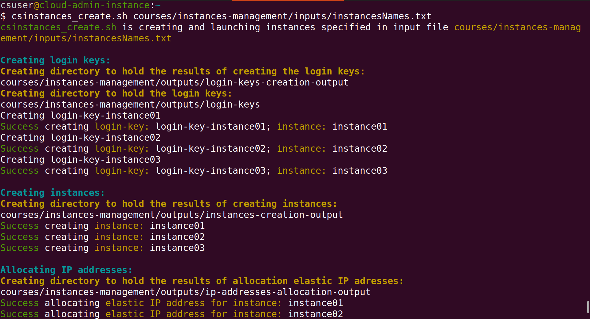

# Summary

We present a set of Bash scripts that automatically manage Amazon Web Services ([AWS](https://aws.amazon.com/)) instances which are Linux virtual machines. We use the scripts to manage multiple instances for training. When running a workshop, instances are created with ‘omics data and software required for the workshop. Each student is granted exclusive access to one instance through the use of an encrypted login key. The scripts require only the names of the instances 
that are to be created, stopped, started or deleted. The login keys, IP addresses and domain names used by the instances are created or deleted automatically. Creating over 30 instances takes 10-15 minutes. 

# Statement of need
Teaching data management and analysis skills using cloud resources is rather efficient and convenient as it avoids the need to buy and manage hardware resources.  Typically, a Linux virtual machine is configured with the required data and software analysis tools and then replicated to provide each student with an individual, real training environment. Once the training is finished the replicated virtual machines are deleted to stop incurring any further cost. Despite these benefits, **managing multiple** virtual machines through a Graphical User Interface (GUI), such as the AWS Console, **is cumbersome** and **error-prone**. Hence we sought to automate managing AWS instances for our workshops. 

# The scripts
AWS services can be managed using the technologies below — the level of automation increases from 1 to 4 [@wittig23]:

1. the AWS Console — used through a browser, suitable for one-off configurations and browsing the state of allocated AWS resources.  

2. the AWS CLI (command line interface) — used from the *terminal*, suitable for repetitive admin tasks.  

3. SDKs (libraries) — used with programming languages (Python, JavaScript etc.), suitable for developing end-user applications that integrate various AWS services.

4. Infrastructure as code (IaC) blueprints —  used with AWS CloudFormation or TerraForm [winkler21],  suitable for managing infrastructures (and component dependencies) that are relatively large or change often.

The scripts make use of the AWS CLI to manage instances and related resources (login keys, IP addresses and domain names), invoking the AWS CLI repeatedly for each instance name specified as described in the next section. The results of each AWS CLI invocation include, when creating instances and related resources, the **resource-id** assigned by AWS to an instance or resource. As the resource-id is needed to further manage the corresponding resource, for example, to delete it, the scripts store the results of each AWS invocation to a file. To enable the scripts to recover the resource-id of resources to delete them based on the names of the relevant instances, the name of each results file has, as a sub-string, the name of the relevant instance.

# Using and running the scripts
How to use the scripts is described in detail in the online course [Automated Management of AWS Instances](https://cloud-span.github.io/cloud-admin-guide-0-overview/) which covers how to: 
- open and configure an AWS account for programmatic access with the AWS CLI as required by the scritps.
- configure a *terminal* environment with the scripts and the AWS CLI in Linux, Mac, Windows (Git Bash), and the AWS CloudShell.
- configure and run the scripts, manage late registrations and cancellations, and troubleshooting.
- create and manage Amazon Machine Images (AMIs) which serve as templates to create AWS instances.
- and more

Once an AWS account and terminal environment have been configured, you need to configure the following three files before running the scripts to create the instances for a workshop:
- **tags.txt** contains a set of key-value pairs to tag the resources to be created.
- **resourcesIDs.txt** contains resources names and id's to use in creating intances, for example: 
  - imageId — ami-00c0ea23e53f48472
  - instanceType — t3.small
  - securityGroupId —	sg-07fde18971b673b39
  - subnetId — subnet-00f3dc83b7407df8c
  - hostZone — cloud-span.aws.york.ac.uk
  - hostZoneId — Z012538133CJ0WPYPR3UZ
- *instancesNames.txt* — contains the name of the instances to be created.

You can use a different name for the file *instancesNames.txt* but you must name the other two files as shown. The three files must be placed within an **inputs** directory within other directory whose name you can choose. The screenshot below shows how to run the script `csinstances_create.sh`.   to create the instances whose name was specified in the file *instancesNames.txt*:

Obviously

# Conclusions

# Acknowledgements

We acknowledge contributions from ...

# References