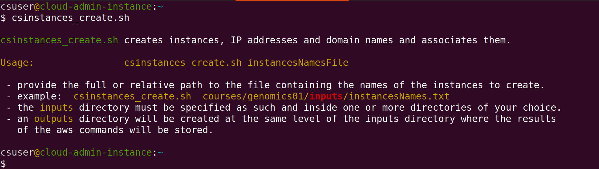

# Summary

We present a set of Bash scripts that automatically manage Amazon Web Services ([AWS](https://aws.amazon.com/)) instances which are Linux virtual machines. We use the scripts to manage multiple instances for training. When running a workshop, instances are created with ‘omics data and software analysis tools required for the workshop. Each student is granted exclusive access to an instance through the use of an encrypted login key with the ``ssh`` program:

``ssh -i login-key-instance01.pem  csuser@instance01.cloud-span.aws.york.ac.uk``

The scripts require only the names of the instances that are to be created, stopped, started or deleted. The login keys, IP addresses and domain names used by the instances are created or deleted automatically. Creating over 30 instances takes 10-15 minutes. 

# Statement of need
Using cloud resources for training is rather efficient and convenient as there is no need to buy and manage hardware resources.  Typically, a Linux virtual machine is configured with the required data and software tools and then replicated to provide each student with an individual, real training environment. Once the training is finished the replicated virtual machines are deleted to stop incurring any further cost. Despite these benefits, **managing multiple** virtual machines through a Graphical User Interface (GUI), such as the AWS Console, **is cumbersome** and **error-prone**. Hence we sought to automate managing AWS instances for our workshops. 

# The scripts design
AWS services can be managed using the AWS Console, the AWS CLI (command line interface), SDKs (libraries) with a programming language, or infrastructure as code (IaC) blueprints.  The level of automation increases from the former to the latter [@wittig23]. 

The scripts make use of the AWS CLI to manage instances and related resources (login keys, IP addresses and domain names), invoking the AWS CLI repeatedly for each instance name specified as described in the next section. 

When creating instances and related resources, the results returned by each AWS CLI invocation include the **resource-id** assigned by AWS to each instance or resource. As a resource-id is needed to further manage the corresponding resource, for example, to delete it, the scripts store the results of each AWS invocation to a file. The name of each file has, as a sub-string, the name of the relevant instance, so that the scripts can later recover the resource-id of the resources to be deleted, stopped, etc. The names of login key files and domain names are managed similarly: including the relevant instance name as a substring. In the `ssh` example above, the instance name specified was ``instance01``, and included as part of both the login key file name and the domain name.

# Configuring the environment and running the scripts
How to use the scripts is described in detail in the online course [Automated Management of AWS Instances](https://cloud-span.github.io/cloud-admin-guide-0-overview/) which covers how to: 

- open and configure an AWS account for programmatic access with the AWS CLI as required by the scritps and with a base domain name to create

- configure a *terminal* environment with the scripts and the AWS CLI in Linux, Mac, Windows (Git Bash), and the AWS CloudShell.

- configure and run the scripts, manage late registrations and cancellations, and troubleshooting.

- create and manage Amazon Machine Images (AMIs) which serve as templates to create AWS instances.

- and more

Once an AWS account and a terminal environment have been configured, the following three files need to be configured before running the scripts to create instances for a workshop:

- **tags.txt** contains a set of key-value pairs to tag the resources to be created.

- **resourcesIDs.txt** contains the names and id's of the resources to use in creating intances, for example: "**imageId**  ami-00c0ea23e53f48472" (the AMI template), "**instanceType** t3.small" (number of processors and memory size), "**securityGroupId** sg-07fde18971b673b39", "**subnetId** subnet-00ff83b7407dcdc83", "**hostZone** cloud-span.aws.york.ac.uk" (base domain name from which to create each instance domain name), and "**hostZoneId** Z01RCJ0WP2538133YP3UZ".

- *instancesNames.txt* — contains the name of the instances to be created. Only this file can be named differently to your choice.

### The scripts
These are the scripts:

```
aws_domainNames_create.sh        aws_instances_configure.sh  csinstances_create.sh
aws_domainNames_delete.sh        aws_instances_launch.sh     csinstances_delete.sh
aws_elasticIPs_allocate.sh       aws_instances_terminate.sh  csinstances_start.sh
aws_elasticIPs_associate2ins.sh  aws_loginKeyPair_create.sh  csinstances_stop.sh
aws_elasticIPs_deallocate.sh     aws_loginKeyPair_delete.sh
aws_elasticIPs_disassociate.sh   colour_utils_functions.sh
```

The scripts `csinstances_*.sh` (on the right) are to be run by the user of the scripts. The scripts `aws_*.sh` are invoked by the scripts `csinstances_create.sh` or `csinstances_delete.sh` to either create or delete instances and related resources. The file `colours_utils_functions.sh` provides (is “sourced” by) the other scripts with text colouring functions and other utility functions.

All the scripts are run the same way, passing as parameter the path of the file *instancesNames.txt* that contains the names of the instances to be created, deleted, stopped, started:



The scripts `aws_*.sh` can also be run directly by the user. This may be useful for improving the scripts or fixing a failed step in creating instances as discussed in the online course troubleshooting section.

### Creating instances 
The screenshot below shows part of the output of `csinstance_create.sh` in creating three instances named `instance01`, `instance02` and `instance03`: 


# Conclusions
Setting up the scripts environment to run the scripts is somewhat involved for the many technologies involved, but the online course covers all the details. It should take 2 to 4 hours depending on experience to cover the course and set up the environment. 

Once the environment is set, using the scripts is rather easy and most convenient. We have saved a lot of time in managing instances for our workshops. Note that the file **tags.txt** needs to be configured only once: you can use it to create instances for differente workshops. Similary, the file **resourcesIDs.txt** needs to be configured only once unless you use a different AMI template or instance types (t3.small, t3.medium, etc.) for different workshops. That is, you will mostly need to configure the file with the names of the instances to create.

# Acknowledgements

We acknowledge contributions from ...

# References